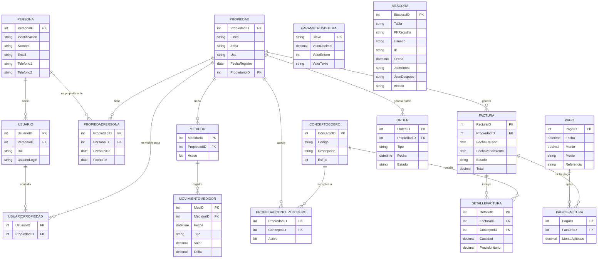

# Diagrama de ambiente (Mermaid)

Copia del diagrama en formato Mermaid. Puedes abrirlo en VS Code con la extensión "Markdown Preview Mermaid Support" o usar la vista previa Mermaid para ver el diagrama.

